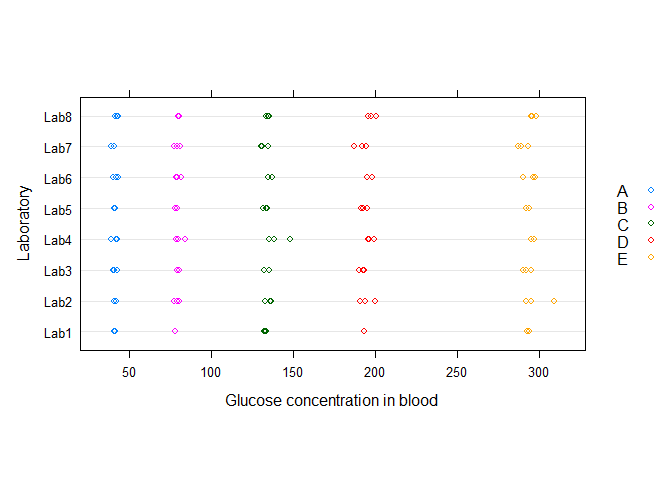
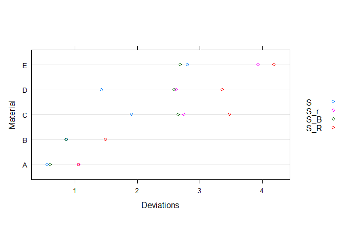
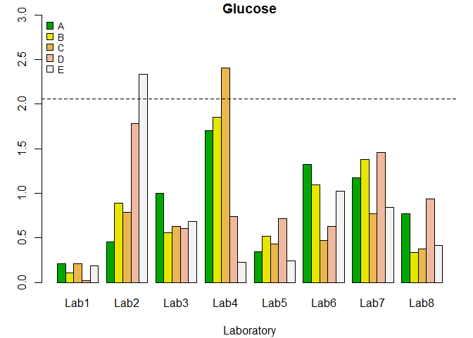
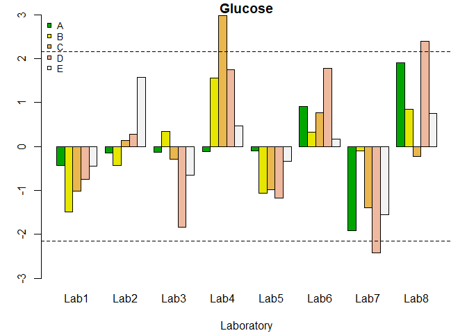

<!-- README.md is generated from README.Rmd. Please edit that file -->

# ILS: An R package for statistical analysis in Interlaboratory Studies

<!-- badges: start -->
<!-- badges: end -->

## Overview

The main objective of the ILS package is to detect laboratories that
provide not consistent results, working simultaneously with different
test materials, from the perspective of the Univariate Data Analysis and
the Functional Data Analysis (FDA).

The ILS package can identify laboratories that provide significantly
different results through the estimation the Mandel’s h and k scalar
statistics, based on the ASTM E691 and ISO 5725-2 standards.
Additionally, the package has implemented tools to assess the presence
of outliers using the Cochran and Grubbs tests.

Furthermore, Analysis of Variance (ANOVA) techniques are provided, both
for the cases of fixed and random effects, including confidence
intervals for the principles parameters.

Moreover, one of the novelties of this package is the incorporation of
tools to perform an ILS from a functional data analysis approach.
Accordingly, the functional nature of the data obtained by experimental
techniques corresponding to analytical chemistry, applied physics and
engineering applications (spectra, thermograms, and sensor signals,
among others) is taking into account by implementing the functional
extensions of Mandel’s h and k statistics.

<br>

## Concepts across the board

**ILS package** addresses several concepts and approaches which will be
discussed in detail in the later sections of this article. The most
relevant concepts can be found below:

-   **Interlaboratory Study (ILS)**:

    This concept can be defined as a control procedure to evaluate the
    performance of a group of laboratories through a collaborative
    trials. In an Interlaboratory Study, an adequate number of
    laboratories are chosen to participate in the experiment with the
    aim of analyzing the samples and obtain results.

    Participating laboratories receive samples (previously homogenized
    or to be homogenized by the laboratories) for analysis, then, the
    measurements results of the laboratories are evaluated according to
    the degree of data variability. Some of the most common factors that
    may be a cause of variability are: the equipment of laboratories,
    operators, materials, temperature and humidity, among others.

-   **Repeatability and Reproducibility studies (R&R)**:

    Repeatability and reproducibility (R&R) studies are a relevant
    methodology in quality control that assess the accuracy of a
    measurement system. In addition, R&R studies allow the
    identification of errors and sources of variation in the measurement
    process, and are essential to ensure the reliability and accuracy of
    the results.

    This tool of quality control focuses on two key aspects of
    measurement:

    **Repeatability:** Repeatability is the variation between successive
    measurements of the same part or trait by the same person using the
    same gage. In other words, how much variation do we see in
    measurements taken by the same person, on the same part, using the
    same tool.

    **Reproducibility:** Reproducibility is the difference in the
    average of the measurements made by different people using the same
    instrument when measuring the identical characteristics on the same
    part. In other words, how much variation do we see in measurements
    taken by different people on the same part using the same too.

-   **Consistency tests**:

    Several scalar statistical techniques are frequently applied to
    study the consistency of test results from the different
    laboratories that participate in an ILS. Standard ASTM E-691
    (Standard Practice for Conducting an Interlaboratory Study to
    Determine the Precision of a Test Method) recommends applying only
    one graphical technique from Mandel’s k and h statistics \[2\],
    while ISO 5725-2 (Accuracy – trueness and precision – of measurement
    methods and results) recommends, in addition to the graphic
    technique, to use the Cochran and Grubbs.

    The 2 standards mentioned can be consulted in the following
    accesses:

    [ASTM E-691](https://www.astm.org/e0691-21.html)

    [ISO
    5725-2](https://es.scribd.com/document/745647300/NTP-ISO-5725-2-2021-Antecedente-2019)

-   **ANOVA tests**:

    The technique of Analysis of Variance (ANOVA), the effect of the
    laboratory factor over the response can be studied. The variance of
    repeatability and reproducibility can be also estimated when an
    ANOVA random effects model is considered, as shown in ISO 5725-2
    \[1\]. On the other hand, if a fixed effect model is fitted, in
    addition to the F test, multiple comparisons of means can be
    performed with the Tukey Honest Significant Difference (HSD) method.

-   **Functional Data Analysis (FDA)**:

    Functional Data Analysis is a relatively new branch of statistics
    that takes curves as unit of analysis, also surfaces, and volumes
    defined in a continuum (such as time, or frequency’s domain).
    Considering the recent advances in computing science, and the
    increasing amount of data generated by experimental techniques and
    sensors, the FDA has had a great development in recent years. In
    fact, we have many statistical methodologies that have been
    developed and extended to the functional case, such as exploratory
    analysis, regression, classification, analysis of variance, and time
    series.

    In the specific case of ILS, FDA extensions for Mandels’s h and k
    have been proposed and described by Flores, in addition to other
    works where the FDA descriptive analysis had been introduced for ILS
    studies.

<br>

## The R Package ILS

The present ILS library implements and calls some of their routines in
order to perform outlier detection in the framework of the
Interlaboratory Studies. Thus, regarding to ILS with scalar response,
there are some interesting and useful computational tools in R software.

Particularly, the metRology package estimates the uncertainty of the
measurement, and performs the required statistical calculations for
Interlaboratory Studies, whereas multcomp performs analysis of variance
(ANOVA) through F and Tuckey tests.

On the other hand, due to the exponential increasing of FDA available
techniques, there are also a continuously increasing number of R
libraries devoted to this branch of statistics. Among all of them, the
most important and used packages (on which the present proposal is
based) are fda.usc, that implements outlier detection techniques and
functional ANOVA, among other tools for FDA, and the fda. The present
ILS package uses the applications of the before mentioned multcomp and
fda.usc

In summary, the functions incorporated to the ILS package to perform
Interlaboratory Studies are classified under the following scheme:

<br>

## Interlaboratory Studies: Standard Approach

The ILS package provides two groups of functions made to detect outlying
individual results (outlying replicates) and outlying laboratories; for
this purpose, the package offers graphical and analytical procedures
(statistical hypothesis test).

As mentioned in the previous section, among the methodologies used to
evaluate the consistency of laboratory results, we must highlight the
r&R studies, which quantify the variability between laboratories
(reproducibility) and variability between results (repeatability).

-   **Mandel’s h and k statistic**:

    Accordingly with the repeatability and reproducibility concepts,
    this statistics are used in ILS to detect laboratories that provide
    inconsistent results. The h statistic explains the variability
    between the laboratories, that is, estimates the bias, which is the
    difference of the means of each laboratory with respect to the
    global mean, while the k statistic estimates the variability within
    the laboratories, comparing the repeatability corresponding to each
    laboratory.

    The decision rule for detecting whether a laboratory is inconsistent
    is based on the comparison between the value of the h or k statistic
    and the critical value, which is normally calculated with a
    significance level of 0.5% (as recommended by ASTM E-691).

-   **Cochran and Grubbs test**:

    The aim oh these tests is to examine the consistency within a
    laboratory, whereas the Grubbs test is commonly used to examine
    consistency between laboratories. The Grubbs test can also be used
    as a consistency test for the results obtained in a laboratory using
    identical materials. These tests are recommended by ISO 5725-2.

Accordingly, consistency tests and identification of atypical results
must be performed previously to ANOVA analysis. There are two possible
scenarios in which the presence of outliers can be evaluated: the first
is that the results of one laboratory deviates from the others in terms
of precision, that is, when the measurements made by a laboratory
significantly differ with respect to the measurements obtained by other
laboratories. The second scenario is related with the identification of
outliers in a laboratory for a certain level.

The statistics and tests recommended by ISO 5725-2 and ASTM E-691 are
described below.

-   **Mandel’s h statistic and Grubbs test**:

    If a laboratory is identified as an outlier, after applying the h
    statistic and the Grubbs test to different levels within a
    laboratory, this is an evidence of the presence of a laboratory high
    bias (due to a high systematic error in calibration, or errors in
    the equations used to compute the results).

-   **Mandel’s k statistic and Cochran test**:

    The Cochran test only evaluates the highest value in a series of
    variances. If a laboratory is detected as an outlier, using the k
    statistic or with the Cochran test, this indicates that the variance
    within the laboratory is high (due to lack of familiarity with the
    analytical method, differences of appreciation among operators,
    inadequate equipment, equipment in poor state, or careless
    execution), in which case the total of results collected by this
    laboratory should be rejected and taken out of the study.

    The detection of inconsistent laboratories must be repeated until it
    stops reporting outliers. However, the consistency tests should be
    used with caution, because if this process is carried out in excess,
    could lead to false outlier identification.

<br>

## Interlaboratory Studies: New FDA Approach

The ILS package have some techniques developed to check if inconsistent
laboratories are detected either by outliers in the within-laboratory or
in between-laboratory variability.

-   **Hypothesis of reproducibility and repeatability**:

    To test the hypothesis that there are no differences in the
    measurements between the laboratories in a study, functional
    statistics Hl(t) and Kl(t) are estimated for each laboratory.

    The null hypothesis of reproducibility states that …

    …….

    To evaluate the reproducibility of the laboratory results, the H(t)
    statistic is calculated as follows:

    …….

    To test the reproducibility hypothesis, the test statistic dH

    …….

    On the other hand, the null hypothesis of repeatability is:

    …….

    The repeatability test is based on the K(t) statistic, expressed as:

    …….

    The test statistic is dK.

A bootstrap procedure to reproduce the distribution of these statistics
under the corresponding null hypothesis is proposed in… This procedure
provides the approximation of the critical values cK and cH of the test
statistics dH and dK, respectively. Additionally, confidence bands for
the functional statistics H(t) and K(t) can be computed (determined by
the envelope of their bootstrap counterparts with a norm less than the
corresponding critical value).

<br>

## ILS package Installation

You can install the development version of ILSR6V1 from
[GitHub](https://github.com/) with:

``` r
# install.packages("ILSR6V1")
library("ILSR6V1")
```

<br>

## ILS package Practical examples

## 1) Clinical study of blood glucose measurement

-   **Graphical and analytical statistics**

The Glucose dataset corresponds to the serum glucose test (measurements
of the concentration of glucose in the blood used to control the
diabetes). In this study, eight laboratories where involved, and five
different tests were performed on blood samples labelled with different
references, ranging from a low sugar content to a very high one. Three
replicates were obtained for each sample.

Each of these laboratories measured five different concentration levels
(A, B, C, D, E) of a given material, and at each of these levels, three
measurements were taken (3 replicates). Each laboratory provided a total
of 15 measurements (3 for each level), therefore, with 8 laboratories
involved, 120 measurements were obtained.

In order to access this dataset, the ILS package installing and loading
is required. Once loading is performed, the Glucose data.frame object is
called using the following instructions.

``` r
suppressWarnings(suppressMessages(library(ILS)))
data("Glucose")
```

The first step to perform an analysis with the ILS package consist on
using the function ils.qcdata() (quality control data) that receives a
data.frame as an argument. By default, the first column of the data
frame must contain the response variable, the second column the
replicates, the third column corresponds to the tested material, while
the fourth column includes the laboratories where the procedure was
performed.

For instance, the following code creates an object qcdata (of class
ils.qcdata) and uses the summary() method to obtain descriptive
statistics information of the dataset.

``` r
qcdata <- lab.qcdata(Glucose)
summary(qcdata)
#>        x          replicate material   laboratory
#>  Min.   : 39.02   1:40      A:24     Lab1   :15  
#>  1st Qu.: 78.45   2:40      B:24     Lab2   :15  
#>  Median :135.03   3:40      C:24     Lab3   :15  
#>  Mean   :149.09             D:24     Lab4   :15  
#>  3rd Qu.:196.66             E:24     Lab5   :15  
#>  Max.   :309.40                      Lab6   :15  
#>                                      (Other):30

plot(qcdata,
     ylab = "Laboratory",
     xlab = "Glucose concentration in blood")
```



The figure shows the obtained values for each laboratory and material.
It can be noted that the blood glucose level increases from material A
to D and there is more variability between the results for each
laboratory from material C to material E.

<br>

In order to calculate the graphical and analytical statistics for the
scalar (univariate) case, first, the function lab.qcs() (quality control
statistics) has to be used. This function returns the estimates of the
statistical required measures (mean, variance, etc.) for computing the
Mandel’s h and k statistics, as well as the required measures to perform
the Cochran and Grubbs tests.

In the following commands, the lab.qcs() function uses the qcdata object
to create the qcstat object that estimates both the mean and the global
deviation from the results of all laboratories and all materials. The
repeatability deviation (Sr), the deviation between the means of
laboratories (SB), and the reproducibility deviation (SR) for each
material are also estimated (following ASTM E-691)

``` r
qcstat <- lab.qcs(qcdata)
summary(qcstat)
#> 
#> Number of laboratories:  8
#> Number of materials:  5
#> Number of replicate:  3
#> Summary for Laboratory (means):
#>        Lab1      Lab2      Lab3      Lab4      Lab5      Lab6      Lab7
#> A  41.28333  41.44000  41.45000  41.45667  41.46333  42.02000  40.45667
#> B  78.31667  79.23333  79.90333  80.96333  78.69000  79.89333  79.51667
#> C 133.19667 135.40667 134.59000 140.83000 133.26667 136.61667 132.49333
#> D 193.65000 195.10667 192.09000 197.21333 193.05000 197.24333 191.26000
#> E 293.25333 298.91667 292.67000 295.82000 293.56333 294.95667 290.13667
#>        Lab8
#> A  42.57667
#> B  80.34667
#> C 134.71000
#> D 198.12333
#> E 296.62000
#> 
#> Summary for Laboratory (Deviations):
#>        Lab1      Lab2      Lab3      Lab4      Lab5     Lab6     Lab7      Lab8
#> A 0.2230097 0.4850773 1.0608016 1.8117763 0.3666515 1.408119 1.247811 0.8224557
#> B 0.1582193 1.3268509 0.8303212 2.7660863 0.7754354 1.636592 2.059935 0.5064912
#> C 0.5909597 2.1679791 1.7287857 6.6200227 1.1987215 1.287025 2.124296 1.0343597
#> D 0.0600000 4.6824068 1.5932043 1.9365519 1.8826311 1.649616 3.817709 2.4637844
#> E 0.7266590 9.1869055 2.7101107 0.8835723 0.9543759 4.034282 3.304184 1.6479078
#> 
#> Summary for Material:
#>        mean         S      S_r       S_B      S_R
#> A  41.51833 0.5543251 1.063224 0.6061274 1.058783
#> B  79.60792 0.8664835 1.496071 0.8627346 1.495481
#> C 135.13875 1.9071053 2.750879 2.6566872 3.478919
#> D 194.71708 1.4262962 2.625065 2.5950046 3.365713
#> E 294.49208 2.8067799 3.934974 2.6931364 4.192334

plot(qcstat,
     xlab = "Deviations",
     ylab = "Material")
```



In the figure presented,, the values of S (the global deviation of all
laboratories), Sr (the repeatability’s deviation), SR (reproducibility’s
deviation) and SB (the deviation between the means of the laboratories)
are shown for each material. A greater variability can be noted from
material C to material E. Materials C and D have a greater variability
between the results of the laboratories (SR) and within them (Sr).

<br>

-   **Consistency tests**

First, an analysis of the variability for each laboratory will be
performed. For this purpose, the k statistic (k.qcs()) and the Cochran
test (cochran.test()) will be used to identify if there is any
laboratory with non-consistent results. Subsequently, the h statistic
(h.qcs()) and the Grubbs test (grubbs.test()) will be used to perform an
analysis to evaluate inter-laboratory variability.

The following code creates an object containing the scalar Mandel’s k
statistic for each laboratory and material, which is subsequently
plotted:

``` r
k <- k.qcs(qcdata, alpha = 0.005)
plot(k)
```



<br> <br> <br>

In the figure above, the dotted line represents the critical value equal
to 2.06, obtained for p = 8, n = 15 and α = 0.005 (following the ASTM
standard). Hence, outliers were detected for the laboratory 2, when
testing the material 5, and for material 3, when is tested by the
laboratory 4, since the corresponding values of the k statistics were
greater than the critical value.

The summary() method prints the violations matrix. If an entry of this
matrix is FALSE, the laboratory reports outlying results for the
corresponding material at the specified significance level.

``` r
summary(k)
#> 
#> Number of laboratories:  8
#> Number of materials:  5
#> Number of replicate:  3
#> Critical value:  2.06084
#> Beyond limits of control: 
#>         A    B     C    D     E
#> Lab1 TRUE TRUE  TRUE TRUE  TRUE
#> Lab2 TRUE TRUE  TRUE TRUE FALSE
#> Lab3 TRUE TRUE  TRUE TRUE  TRUE
#> Lab4 TRUE TRUE FALSE TRUE  TRUE
#> Lab5 TRUE TRUE  TRUE TRUE  TRUE
#> Lab6 TRUE TRUE  TRUE TRUE  TRUE
#> Lab7 TRUE TRUE  TRUE TRUE  TRUE
#> Lab8 TRUE TRUE  TRUE TRUE  TRUE
```

The Cochran’s test can be performed with the cochran.test() function. In
this case study, with the maximum variance for each material, no
laboratory was considered inconsistent, since the critical value was
0.52 and the p-values for each material exceeded the 5% significance
level.

``` r
cochran.test(qcdata)
#> 
#> Test Cochran 
#> 
#>  Critical value: 0.5156875 
#> 
#>  Alpha test: 0.00625 
#>   Smax Material          C p.value
#> 1 Lab4        A 0.20033869  0.0231
#> 2 Lab4        B 0.15447962  0.0102
#> 3 Lab4        C 0.10935197  0.0029
#> 4 Lab2        D 0.08493741  0.0010
#> 5 Lab2        E 0.07416440  0.0005
```

We proceeded to use the methods h.qcs() and plot() to estimate and plot
the h statistics for each laboratory and material. The critical value
was 2.15, therefore, from this result it can be seen in Figure 6 that
laboratories 4, 7 and 8 presented non-consistent results at a
significance level of α = 0.005.

``` r
h <- h.qcs(qcdata, alpha = 0.005)
plot(h)
```



``` r
summary(h)
#> 
#> Number of laboratories:  8
#> Number of materials:  5
#> Number of replicate:  3
#> Critical value:  2.152492
#> Beyond limits of control: 
#>         A    B     C     D    E
#> Lab1 TRUE TRUE  TRUE  TRUE TRUE
#> Lab2 TRUE TRUE  TRUE  TRUE TRUE
#> Lab3 TRUE TRUE  TRUE  TRUE TRUE
#> Lab4 TRUE TRUE FALSE  TRUE TRUE
#> Lab5 TRUE TRUE  TRUE  TRUE TRUE
#> Lab6 TRUE TRUE  TRUE  TRUE TRUE
#> Lab7 TRUE TRUE  TRUE FALSE TRUE
#> Lab8 TRUE TRUE  TRUE FALSE TRUE
```

-   **Outliers detection**

Laboratories with very extreme results were detected by using the
Grubbs’ test, i.e. laboratories defined by very large or small results
(glucose content).

``` r
grubbs.test(qcdata)
#> 
#> Test Grubbs 
#> 
#>  Critical value: 1.154478 
#> 
#>  Alpha test: 0.00625 
#>   Material Gmax    G.max p.value.max Gmin    G.min p.value.min
#> 1        A Lab8 1.909229      0.0489 Lab7 1.915242      0.0485
#> 2        B Lab4 1.564273      0.0809 Lab1 1.490219      0.0899
#> 3        C Lab4 2.984235      0.0102 Lab7 1.387137      0.1040
#> 4        D Lab8 2.388179      0.0241 Lab7 2.423819      0.0229
#> 5        E Lab2 1.576391      0.0795 Lab7 1.551749      0.0823
```

Once the outlier laboratories are removed, one-way ANOVA analysis and
mean comparison test can be performed. The ILS package provides function
ils.aov() to perform an analysis of variance considering random or fixed
effects of the laboratory factor depending on the value of the random
argument. By setting this parameter to TRUE, a random effects one-way
ANOVA is done for each material, providing the corresponding F tests and
confidence intervals for the variances. For instance, the following code
shows an example using the results of one material for the sake of
simplicity.

``` r
Glucose2 <- subset(Glucose, Material == "A")
Glucose2 <- lab.qcdata(Glucose2)
lab.aov(Glucose2, random = TRUE, level = 0.95)
#> 
#>  AOV of Material: 1            Df Sum Sq Mean Sq F value Pr(>F)
#> laboratory   7  7.715   1.102   0.975  0.482
#> Residuals   16 18.087   1.130
#> Warning in RET$pfunction("adjusted", ...): Completion with error > abseps
#> 
#>   Simultaneous Tests for General Linear Hypotheses
#> 
#> Multiple Comparisons of Means: Tukey Contrasts
#> 
#> 
#> Fit: aov(formula = y ~ laboratory, data = data)
#> 
#> Linear Hypotheses:
#>                   Estimate Std. Error t value Pr(>|t|)
#> Lab2 - Lab1 == 0  0.156667   0.868119   0.180    1.000
#> Lab3 - Lab1 == 0  0.166667   0.868119   0.192    1.000
#> Lab4 - Lab1 == 0  0.173333   0.868119   0.200    1.000
#> Lab5 - Lab1 == 0  0.180000   0.868119   0.207    1.000
#> Lab6 - Lab1 == 0  0.736667   0.868119   0.849    0.987
#> Lab7 - Lab1 == 0 -0.826667   0.868119  -0.952    0.975
#> Lab8 - Lab1 == 0  1.293333   0.868119   1.490    0.802
#> Lab3 - Lab2 == 0  0.010000   0.868119   0.012    1.000
#> Lab4 - Lab2 == 0  0.016667   0.868119   0.019    1.000
#> Lab5 - Lab2 == 0  0.023333   0.868119   0.027    1.000
#> Lab6 - Lab2 == 0  0.580000   0.868119   0.668    0.997
#> Lab7 - Lab2 == 0 -0.983333   0.868119  -1.133    0.940
#> Lab8 - Lab2 == 0  1.136667   0.868119   1.309    0.883
#> Lab4 - Lab3 == 0  0.006667   0.868119   0.008    1.000
#> Lab5 - Lab3 == 0  0.013333   0.868119   0.015    1.000
#> Lab6 - Lab3 == 0  0.570000   0.868119   0.657    0.997
#> Lab7 - Lab3 == 0 -0.993333   0.868119  -1.144    0.937
#> Lab8 - Lab3 == 0  1.126667   0.868119   1.298    0.887
#> Lab5 - Lab4 == 0  0.006667   0.868119   0.008    1.000
#> Lab6 - Lab4 == 0  0.563333   0.868119   0.649    0.997
#> Lab7 - Lab4 == 0 -1.000000   0.868119  -1.152    0.934
#> Lab8 - Lab4 == 0  1.120000   0.868119   1.290    0.890
#> Lab6 - Lab5 == 0  0.556667   0.868119   0.641    0.998
#> Lab7 - Lab5 == 0 -1.006667   0.868119  -1.160    0.932
#> Lab8 - Lab5 == 0  1.113333   0.868119   1.282    0.893
#> Lab7 - Lab6 == 0 -1.563333   0.868119  -1.801    0.628
#> Lab8 - Lab6 == 0  0.556667   0.868119   0.641    0.998
#> Lab8 - Lab7 == 0  2.120000   0.868119   2.442    0.286
#> (Adjusted p values reported -- single-step method)
#> 
#> 
#>   Simultaneous Confidence Intervals
#> 
#> Multiple Comparisons of Means: Tukey Contrasts
#> 
#> 
#> Fit: aov(formula = y ~ laboratory, data = data)
#> 
#> Quantile = 3.4603
#> 95% family-wise confidence level
#>  
#> 
#> Linear Hypotheses:
#>                  Estimate  lwr       upr      
#> Lab2 - Lab1 == 0  0.156667 -2.847316  3.160650
#> Lab3 - Lab1 == 0  0.166667 -2.837316  3.170650
#> Lab4 - Lab1 == 0  0.173333 -2.830650  3.177316
#> Lab5 - Lab1 == 0  0.180000 -2.823983  3.183983
#> Lab6 - Lab1 == 0  0.736667 -2.267316  3.740650
#> Lab7 - Lab1 == 0 -0.826667 -3.830650  2.177316
#> Lab8 - Lab1 == 0  1.293333 -1.710650  4.297316
#> Lab3 - Lab2 == 0  0.010000 -2.993983  3.013983
#> Lab4 - Lab2 == 0  0.016667 -2.987316  3.020650
#> Lab5 - Lab2 == 0  0.023333 -2.980650  3.027316
#> Lab6 - Lab2 == 0  0.580000 -2.423983  3.583983
#> Lab7 - Lab2 == 0 -0.983333 -3.987316  2.020650
#> Lab8 - Lab2 == 0  1.136667 -1.867316  4.140650
#> Lab4 - Lab3 == 0  0.006667 -2.997316  3.010650
#> Lab5 - Lab3 == 0  0.013333 -2.990650  3.017316
#> Lab6 - Lab3 == 0  0.570000 -2.433983  3.573983
#> Lab7 - Lab3 == 0 -0.993333 -3.997316  2.010650
#> Lab8 - Lab3 == 0  1.126667 -1.877316  4.130650
#> Lab5 - Lab4 == 0  0.006667 -2.997316  3.010650
#> Lab6 - Lab4 == 0  0.563333 -2.440650  3.567316
#> Lab7 - Lab4 == 0 -1.000000 -4.003983  2.003983
#> Lab8 - Lab4 == 0  1.120000 -1.883983  4.123983
#> Lab6 - Lab5 == 0  0.556667 -2.447316  3.560650
#> Lab7 - Lab5 == 0 -1.006667 -4.010650  1.997316
#> Lab8 - Lab5 == 0  1.113333 -1.890650  4.117316
#> Lab7 - Lab6 == 0 -1.563333 -4.567316  1.440650
#> Lab8 - Lab6 == 0  0.556667 -2.447316  3.560650
#> Lab8 - Lab7 == 0  2.120000 -0.883983  5.123983
#> $Models
#> $Models$`Material: A`
#> Call:
#>    aov(formula = y ~ laboratory, data = data)
#> 
#> Terms:
#>                 laboratory Residuals
#> Sum of Squares     7.71520  18.08713
#> Deg. of Freedom          7        16
#> 
#> Residual standard error: 1.063224
#> Estimated effects may be unbalanced
#> 
#> 
#> $Confidence
#> $Confidence$`Material: A`
#> 
#>   Simultaneous Confidence Intervals
#> 
#> Multiple Comparisons of Means: Tukey Contrasts
#> 
#> 
#> Fit: aov(formula = y ~ laboratory, data = data)
#> 
#> Quantile = 3.4603
#> 95% family-wise confidence level
#>  
#> 
#> Linear Hypotheses:
#>                  Estimate  lwr       upr      
#> Lab2 - Lab1 == 0  0.156667 -2.847316  3.160650
#> Lab3 - Lab1 == 0  0.166667 -2.837316  3.170650
#> Lab4 - Lab1 == 0  0.173333 -2.830650  3.177316
#> Lab5 - Lab1 == 0  0.180000 -2.823983  3.183983
#> Lab6 - Lab1 == 0  0.736667 -2.267316  3.740650
#> Lab7 - Lab1 == 0 -0.826667 -3.830650  2.177316
#> Lab8 - Lab1 == 0  1.293333 -1.710650  4.297316
#> Lab3 - Lab2 == 0  0.010000 -2.993983  3.013983
#> Lab4 - Lab2 == 0  0.016667 -2.987316  3.020650
#> Lab5 - Lab2 == 0  0.023333 -2.980650  3.027316
#> Lab6 - Lab2 == 0  0.580000 -2.423983  3.583983
#> Lab7 - Lab2 == 0 -0.983333 -3.987316  2.020650
#> Lab8 - Lab2 == 0  1.136667 -1.867316  4.140650
#> Lab4 - Lab3 == 0  0.006667 -2.997316  3.010650
#> Lab5 - Lab3 == 0  0.013333 -2.990650  3.017316
#> Lab6 - Lab3 == 0  0.570000 -2.433983  3.573983
#> Lab7 - Lab3 == 0 -0.993333 -3.997316  2.010650
#> Lab8 - Lab3 == 0  1.126667 -1.877316  4.130650
#> Lab5 - Lab4 == 0  0.006667 -2.997316  3.010650
#> Lab6 - Lab4 == 0  0.563333 -2.440650  3.567316
#> Lab7 - Lab4 == 0 -1.000000 -4.003983  2.003983
#> Lab8 - Lab4 == 0  1.120000 -1.883983  4.123983
#> Lab6 - Lab5 == 0  0.556667 -2.447316  3.560650
#> Lab7 - Lab5 == 0 -1.006667 -4.010650  1.997316
#> Lab8 - Lab5 == 0  1.113333 -1.890650  4.117316
#> Lab7 - Lab6 == 0 -1.563333 -4.567316  1.440650
#> Lab8 - Lab6 == 0  0.556667 -2.447316  3.560650
#> Lab8 - Lab7 == 0  2.120000 -0.883983  5.123983
```

<br> <br>

## 2) Characterization of materials by thermogravimetric analysis

-   **Graphical and analytical statistics**
